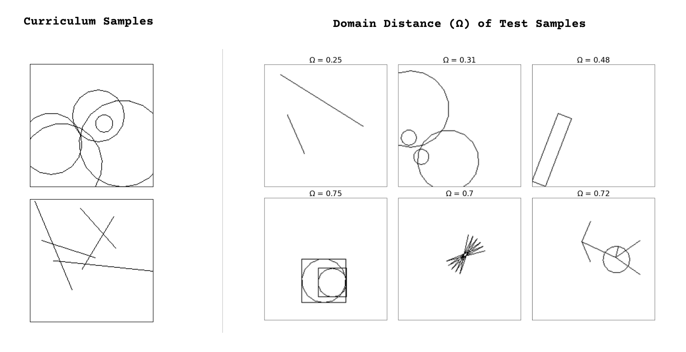

# Flatland

Flatland is an environment for program synthesis experiments. The goal is to
train models which can write programs controlling a ‘pen’ to draw any arbitrary
target image. Methods to learn and generate programs in the Flatland flow-based
"link" language may surface insights to tackle more complex real-world tasks as
described in the paper "Towards a Measure of General Machine Intelligence" on
[arxiv:2109.12075][paper].

## Installation

This package was developed on Python 3.7.12 on a Linux-based system. You may
need to create the necessary virtual environment before installing this package.

```bash
git clone https://github.com/mayahq/flatland
cd flatland
python3 -m pip install -e .
flatland-draw --help
flatland-draw ./library/stickman.fbp
```

[graphviz][graphviz] is required only for visualizing program relationships:

```bash
python3 -m pip install -e .[full]
# or just install graphviz
python3 -m pip install graphviz
```

In case you're on a server, `tkinter` might fail because there is no display
device, so [install `xvfb` and try again](https://stackoverflow.com/a/48212313).

```bash
# assuming Debian/Ubuntu
apt install xvfb
Xvfb :8 -screen 0 1280x720x24 2>/tmp/Xvfb.log &
export DISPLAY=:8
```

### Features

1. **Reusable** : Each node in a Flatland program is a "black box" process
connected to other nodes. This type of data-only coupling increases modularity
makes them easy to extend, modify and reuse without knowing about the rest of
the program.
2. **Expressive** : Flatland's basic primitives - `move`, `turn` and `loop` can
be used to express a wide range of complex shapes.
3. **Composable** : The functional factory model allows the bundling of
low-level components into higher-order "subflows", which can be then be reused
as components for more complex tasks. This opens up ways to create human-like
learners that grow new concepts on top of already-built knowledge.
4. **Interpretable** : The visual representation allows humans to reason quickly
about program behaviour, while the graph structure allows algorithms to easily
analyze them as discrete networks to score performance and calculate quantities
like generalization difficulty.
5. **State** : The `position` and `rotation` state of the turtle is passed from
node to node in the form of this message : `{'position': (49.00,39.00), 'theta':
0.0}` . Flatland programs are data processing "factories" of connected
components that just mutate and pass on the state passed to them.
6. **Built-in Data Augmentation** : plug any flow program into the
`flatland-augment` CLI to create variations for training purposes.
7. **Benchmarks** : Flatland allows measurement of generalization index
(g-index), hence different intelligence systems can be compared viz a viz how
efficiently they can convert previous knowledge and experience into performance
on an unknown image.

### Syntax

Flatland's flow-based programs (FBP) are defined as networks of reusable
components running "black-box" processes, which communicate via data chunks
(called information packets) travelling across predefined connections (think
"conveyor belts"). 

Running [`stickman.fbp`][stickman] with `flatland-draw` generates
the below image.


```
#include "circle.fbp"

@param {theta} (choice (30 45 60))
limbs(start theta) -> move1(move 5 0)
move1 -> turn2(turn theta)
turn2 -> move2(move 10 0)
move2 -> move3(move -10 1) 
move3 -> turn3(turn (* -2 theta))
turn3 -> move4(move 10 0)
move4 -> move5(move -10 1)
move5 -> turn4(turn theta)
turn4 -> limbs(end)

@param {headsize} (int (5 20))
@param {limbsangle} (choice (30 45 60))
stickman(start headsize limbsangle) -> head(circle headsize)
head -> turn1(turn -90)
turn1 -> arms(limbs limbsangle)
arms -> torso(move 20 0)
torso -> legs(limbs limbsangle)
legs -> stickman(end)

{"position":[53,53], "theta":20} -> stickman(10 45)
```


The parts of these programs within parentheses are essentially in a LISP syntax
(eg.  `turn3(turn (* -2 theta))`).  Entire Flatland programs can also be
expressed in a similar way.

## Data Augmentation

Notice the following lines in [`stickman.fbp`][stickman]:

```
@param {theta} (choice (30 45 60))

@param {headsize} (int (5 20))
@param {limbsangle} (choice (30 45 60))
```

These lines enable creating similar programs to [`stickman.fbp`][stickman] by
randomizing the `headsize` and `limbsangle` parameters (`headsize` is a random
integer between 5 and 20, `limbsangle` is selected randomly from the given
list). You can provide similar randomizer annotations of `int`, `float`, `bool`,
and `choice` to your program for data augmentation. To generate programs with
randomized parameters, you can use the `flatland-augment` command:

```bash
flatland-augment --help
flatlang-augment ./library/stickman.fbp -o ./outputs --num-samples 5
```

`flatland-augment`  generates and run `.fbp` programs to create a
large number of (`png`/`json`/`lisp`) in the given folder.

## Compare individual programs

To compare individual programs, you can use the `flatland-scoring` command:

```bash
flatland-scoring --help
flatland-scoring tmp_file1.fbp  tmp_file2.fbp
```

## Compute domain distance between two sets of programs

After training and testing a model, you can compute its
[`g-index`][gindex], for which you need to calculate the domain distance of each
test sample.



To calculate the domain distance between a training set and a test set, you can
use the `flatland-ddist` command:

```bash
flatland-ddist --help
flatland-ddist --train-set ./train_folder --test-set ./test_folder -o test_dd.csv
```

For `N` training samples and `k` test samples, the domain distance calculation
needs to run `N x k` comparisons. This may take quite some time, because the
comparisons are done sequentially and each comparison is unoptimized.

## Use different libraries of programs

Flatland uses 3 basic primitives  -- `loop`, `move`, and `turn` -- from which we
can construct complex flows. We have provided a default library of flows
[here](./library/), but you can also your own library with the `--library`
option.

```bash
flatland-draw myfile.fbp --library /location/of/my/fbp/programs/
flatland-scoring myfile1.fbp myfile2.fbp --library /location/of/my/fbp/programs/
flatland-augment myfile.fbp --library /location/of/my/fbp/programs/
flatland-ddist --train-set ./train_set --test-set ./test_set --library /location/of/my/fbp/programs/
```

To express dependencies between flows in a library, we use a directed graph,
where each node is a flow: we draw an edge from flow `a` to flow `b` if `b` is
composed of `a`.  The `flatland-library` command provides a JSON expressing the
relationship and uses [`graphviz`][graphviz] Python package to visualize the
digraph:


## Acknowledgements

Flatland uses Python's [`turtle`][turtle] graphics and [`tkinter`][tkinter] to
generate the images. LISP Interpreter code is from Peter Norvig's [(How to Write
a (Lisp) Interpreter (in Python))](https://norvig.com/lispy.html), with
modifications for creating nodes and rendering images

[graphviz]: https://graphviz.readthedocs.io/en/stable/manual.html
[paper]: https://arxiv.org/abs/2109.12075
[turtle]: https://docs.python.org/3.7/library/turtle.html
[tkinter]: https://docs.python.org/3.7/library/tkinter.html
[jinja2]: https://jinja.palletsprojects.com/en/3.0.x/
[gindex]: https://github.com/mayahq/g-index-benchmark
[stickman]: ./library/stickman.fbp
