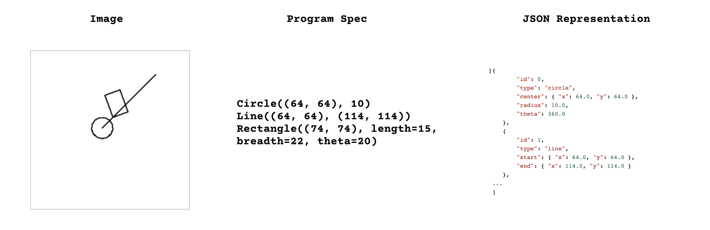

> This is a WIP port of `flatland` to be evaluated with a LISP syntax and
simpler primitives like `move`,`turn`,`warp-by`, and `loop-upto`. LISP
Interpreter code is from Peter Norvig's [(How to Write a (Lisp) Interpreter (in
Python))](https://norvig.com/lispy.html), with a few modifications to render the
image.

> While LISP S-Expressions are not DAGs, they are ASTs, therefore the scoring
and domain distance functions will need to change to handle the AST structure
instead. One of the goals is to examine how much recursion+looping in ASTs
affect program aliasing.

> TODO: convert domain templates, scoring function, and domain-distance
calculation to use LISP.

# flatland

`flatland` is a toy environment to compute the [`g-index`][gindex] when
synthesizing programs from images, described in "Towards a Measure of General
Machine Intelligence" on [arxiv:2109.12075][paper]. 



`flatland` uses Python's [`turtle`][turtle] graphics and [`tkinter`][tkinter] to
generate the images, and [`Jinja2`][jinja2] for randomized generation of
Python programs.

## Installation

This package was developed on Python 3.7.12 on a Linux-based system. You may
need to create the necessary virtual environment before installing this package.

```bash
pip install git+https://github.com/mayahq/flatland
flatland-sample --help
flatland-sample
# view sample.png
```

I prefer cloning the repo and using an editable install.

```bash
git clone https://github.com/mayahq/flatland
cd flatland
pip install -e .
flatland-sample --help
flatland-sample
# view sample.png
```

In case you're on a server, `tkinter` might fail because there is no display
device, so [install `xvfb` and try again](https://stackoverflow.com/a/48212313).

```bash
# assuming Debian/Ubuntu
apt install xvfb
Xvfb :8 -screen 0 1280x720x24 2>/tmp/Xvfb.log &
export DISPLAY=:8
```

## Generating the datasets

The bash script [`generate-dataset.bash`][the_script] to generate a training set
and test sets of three difficulty levels. Note that
[`generate-dataset.bash`][the_script] generates and runs Python code to create a
large number of (`png`/`json`/`py`) files in the given folder.

To generate custom datasets, you can use the `flatland-generate` command:

```bash
flatland-generate --help
```

## Comparing individual programs

To compare individual programs, you can use the `flatland-scoring` command:

```bash
flatland-scoring --help 
flatland-scoring tmp_file1.json  tmp_file2.json
```

## Computing domain distance

After training and testing a model, you would need to compute its
[`g-index`][gindex], for which you need to calculate the domain distance of each
test sample. 


To calculate the domain distance between a training set and a test set, you can
use the `flatland-ddist` command:

```bash
flatland-ddist --help
flatland-ddist --train-set ./train_folder --test-set ./test_folder -o test_dd.csv
```

For `N` training samples and `k` test samples, the domain distance calculation
needs to run `N x k` comparisons.  This may take quite some time, because the
comparisons are done sequentially and each comparison is unoptimized.

[paper]: https://arxiv.org/abs/2109.12075
[turtle]: https://docs.python.org/3.7/library/turtle.html
[tkinter]: https://docs.python.org/3.7/library/tkinter.html
[Jinja2]: https://jinja.palletsprojects.com/en/3.0.x/
[gindex]: https://github.com/mayahq/g-index-benchmark
[the_script]: ./generate-dataset.bash
